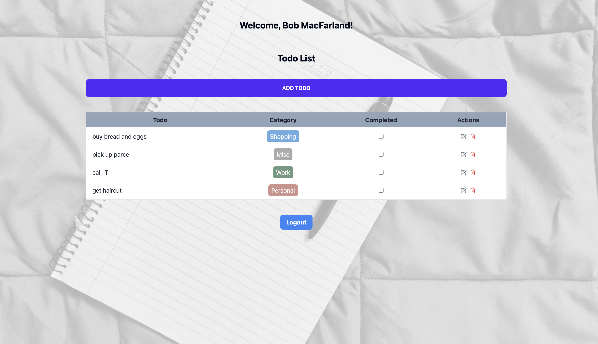

# Todo-App

> This is a full-stack Todo application built with React on the front end and NestJS on the back end. It allows users to create an account, sign in, and manage their todos. The back end uses authentication with username and password validation, and the passwords are securely encrypted using bcrypt. The application utilizes PostgreSQL as the database, which is containerized with Docker. TypeORM is used for creating and managing the database tables.

## Features

- **User Registration and Authentication**:
  - Users can create an account with a username, name, and password.
  - The backend validates the username and password for authentication.
- **Todo Management**:
  - Users can create new todos by entering todo text and selecting a category from a dropdown menu.
  - Todos can be edited, allowing users to modify the text and/or category.
  - Todos can be marked as completed by checking a checkbox.
  - Users can delete todos they no longer need.
  - Todos can be prioritized by dragging and dropping them to change their position in the list using the react-beautiful-dnd library.
- **Session Management**:
  - If the app remains inactive for more than one hour, the user must sign in again to continue using the app.

## Project Structure

- Frontend: React components, API services, and TypeScript types
- Backend: Controllers, services, and DTOs for todos and authentication
- Database: PostgreSQL with TypeORM

## Getting Started

> Prerequisites: Before you begin, make sure Docker is installed and running on your system. 
> You can check this by running docker --version in your terminal.

**Clone the repository!!**

### Frontend
- Navigate to the frontend directory: cd front
- Install the frontend dependencies: npm install
- Start the frontend development server: npm start

### Backend
- Navigate to the backend directory: cd ../back
- Install the backend dependencies: npm install
- Start the backend server: npm run start:dev

### Docker
- Navigate to root directory of project
- Start the PostgreSQL container using Docker Compose: docker compose up
- Verify the container is running: docker ps
- Connect your application to the PostgreSQL database using the following details:
    - Host: 127.0.0.1
    - Port: 5432
    - Username: see docker-compose.yml
    - Password: see docker-compose.yml
    - Database Name: todo
- Stopping and Removing the Containers (Optional): When you're done with the application and want to stop and remove the containers, you can use the following command: docker compose down

## Docker Cleanup Script

I've also provided a handy script that you can use to clean up Docker containers and images. This script can be useful when you want to stop and remove all containers and images, as well as clean up any unused resources. Please use it with caution, as it will remove all stopped containers and images.

### Usage

- Open a terminal.
- Navigate to the root directory.
- Run the following command to execute the cleanup script: ./docker-clean.sh

## Screenshots

| Screenshot 1 | Screenshot 2 |
|--------------|--------------|
|  |  |

| Screenshot 3 | Screenshot 4 |
|--------------|--------------|
|  |  |

| Screenshot 5 | Screenshot 6 |
|--------------|--------------|
|  |  |
